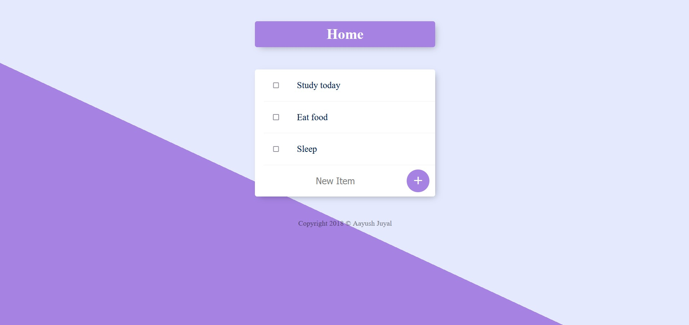

# To-Do List App using Node.js, EJS, and MongoDB

The To-Do List App is a web-based application built with Node.js, EJS, and MongoDB that allows users to create, manage, and track their tasks efficiently.

## Features

- Create tasks with titles.
- Organize tasks into categories or tags.
- Delete them when done.
- User-friendly interface for a seamless task management experience.
- Real-time updates and data persistence through MongoDB.

## Getting Started

1. Clone the repository: `git clone https://github.com/aj12-houdini/To-do-app.git`
2. Navigate to the project directory: `cd todo-list-app`
3. Install dependencies: `npm install`
4. Start the application: `npm start`

## Usage

1. Open the app in your preferred web browser.
2. Click "Add Task" to create a new task.
3. Mark tasks as completed or delete them when done.
4. Organize tasks by adding relevant categories or tags.
5. Tasks are saved in real-time and persist between sessions.

## Technologies Used

- Node.js for building the backend server and API.
- Express.js for routing and handling server requests.
- EJS (Embedded JavaScript) for dynamic HTML templates.
- MongoDB for data storage and retrieval.
- Mongoose for interacting with the MongoDB database.
- CSS for styling the application and ensuring an attractive layout.

## Screenshots

## Contributing

Contributions are welcome! If you have ideas for improvements or find any issues, please [open an issue](https://github.com/aj12-houdini/To-do-app.git/issues) or submit a pull request.

